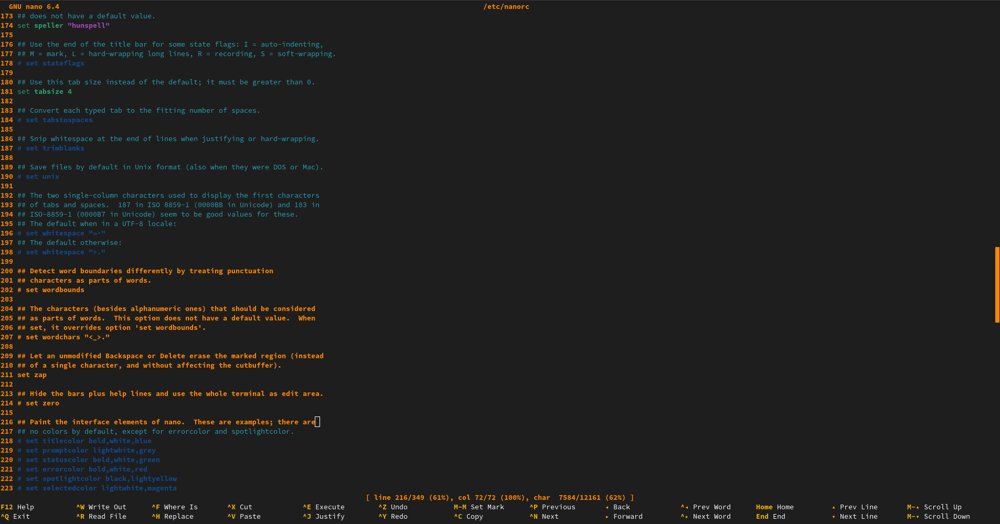

# Nanostyle

## Purpose

A simple nanorc file for replacing the default keybinds and graphical style in /etc/nanorc (system wide).

I will probably work on the sub-menus the other day (if that's possible to begin with).

<details> 
  <summary><b>Comment on why</b></summary>

    I had been slowly drinking from my Chinese big mug of tea on Sunday and wondered what to do with nano that would waste my time with all kind of weird key bindings from the times of Vim (it's 2023 and the era of VSC).

    Sometimes it is necessary to change just few files or even single lines and it would be just GREAT if one could use normal shortcuts like ctrl+c, ctrl+v and delete/cut without searching for how to do it online or in the documentation...
    
    That would make a lot of sense, right?
</details>

## Installation
```
> sudo rm /etc/nanorc
> sudo mv <git-path/nanorc> /etc/nanorc
```

## Documentation
#### Why binding arrows the most likely doesn't work
> https://lists.gnu.org/archive/html/nano-devel/2016-08/msg00043.html
#### Key bindings and functions in nano
> https://www.nano-editor.org/dist/latest/nano.html#Rebinding-Keys

## Preview
